# DeepFlow — System Architecture Document

**Purpose of this document:** to explain, in plain language, how the DeepFlow system is built, so that another software team could take over maintenance or development without having to reverse-engineer the code from scratch.

**What DeepFlow is:** a job-management, compliance-certificate, and invoicing system for a trades/property-services business (electrical, gas, compliance certificates, etc.). It has three separate front-facing applications used by three different kinds of people: office staff, field engineers, and clients (landlords/agencies/agents).

---

## Table of Contents

1. [Folder Structure](#1-folder-structure)
2. [Application Architecture](#2-application-architecture)
3. [Frontend Architecture](#3-frontend-architecture)
4. [Backend Architecture](#4-backend-architecture)
5. [Supabase Architecture](#5-supabase-architecture)
6. [Storage Architecture](#6-storage-architecture)
7. [Authentication Architecture](#7-authentication-architecture)
8. [Database Architecture](#8-database-architecture)
9. [File Relationships](#9-file-relationships)
10. [Cross-App Communication](#10-cross-app-communication)
11. [Realtime Synchronization](#11-realtime-synchronization)
12. [User Flows](#12-user-flows)
13. [Data Flows](#13-data-flows)
14. [Dependencies — Every External Library Explained](#14-dependencies--every-external-library-explained)
15. [Architectural Risks & Notes for Future Maintainers](#15-architectural-risks--notes-for-future-maintainers)

---

## 1. Folder Structure

This is the entire repository. There are no subfolders.

```
DEEPFLOW/
├── index.html          1.31 MB   Office / Admin application
├── office.html          1.31 MB   Byte-for-byte identical copy of index.html
├── engineer.html        209 KB   Field Engineer mobile app (PWA)
└── client-portal.html   140 KB   Client / Landlord / Agency portal (no login)
```

A few things are unusual here, and worth stating clearly for anyone new to the project:

- **There is no `src/` folder, no `assets/` folder, no `components/` folder.** Every application is a single HTML file containing its own CSS and JavaScript inline. Nothing is split into separate `.css` or `.js` files.
- **There is no `package.json`, no `node_modules`, no build tool** (no Webpack, Vite, npm scripts, etc.). Nothing is compiled or bundled. The files you see are exactly what a browser downloads and runs.
- **There is no `supabase/` folder** with migration files, and no `.github/` folder with CI/CD workflows. This project has no automated pipeline of any kind.
- **`index.html` and `office.html` are the same file twice** (confirmed identical, byte-for-byte). This is most likely two different public URLs pointing at the same app (e.g. one for a default landing page, one for a memorable staff URL), not two different versions.
- Because there's no build step, **deployment is just "upload these 4 files to any static web host"** — e.g. a plain web server, Netlify, Vercel (static mode), GitHub Pages, or even a shared folder served by IIS/Apache/Nginx. No server-side runtime (Node, PHP, etc.) is required to host these files.

---

## 2. Application Architecture

DeepFlow is a **3-tier architecture**, but the middle tier (the "backend") is not custom-built — it is entirely provided by **Supabase**, a third-party Backend-as-a-Service platform. There is no backend code written by this project's developers at all (aside from a handful of optional SQL snippets, explained in Section 5).

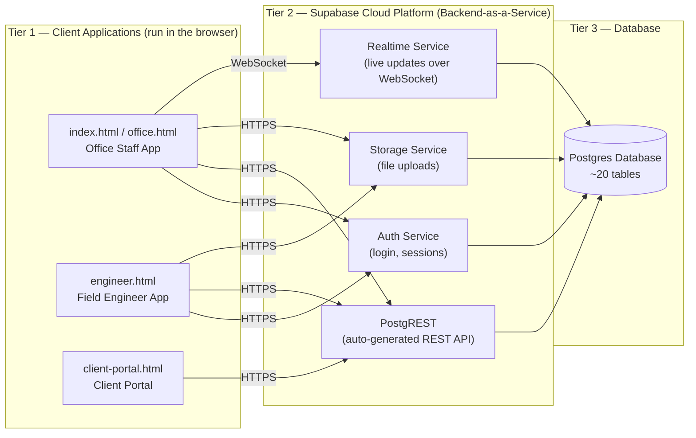

**Key idea:** the three apps do not talk to each other. They are three independent "windows" into the same shared database. If office staff create a job, the engineer app doesn't get told directly — it finds out because it later asks the database "what are my jobs?" and the new job is there.

There is **no custom backend server** — no Node.js/Express, no Python/Django, no PHP. Every piece of "backend" work (checking passwords, storing data, storing photos, pushing live updates) is done by Supabase's managed services. The only "server code" in the whole system is a small number of SQL functions that run *inside* the Postgres database itself (see Section 5) — and even those are optional, and installed manually by an admin, not deployed automatically.

---

## 3. Frontend Architecture

All three apps follow the same internal pattern, because they were clearly built by copying the same base structure three times and customising each copy. Each HTML file has four parts stacked in order:

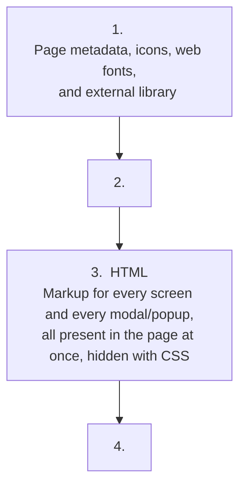

**No frontend framework is used.** There is no React, Vue, Angular, or Svelte anywhere in this codebase. It is plain ("vanilla") JavaScript and plain HTML/CSS. Screens are built by JavaScript functions that generate HTML text (using JavaScript template strings, e.g. `` `<div>${value}</div>` ``) and insert it into the page with `element.innerHTML = ...`.

**"Pages" are not real pages.** There is only one URL per app (no client-side router like React Router). What looks like navigating to a different page (e.g. clicking "Invoices" in the office app) is really just a JavaScript function (`nav('inv')`) that hides one `<div>` and shows another `<div>` that was already sitting in the HTML the whole time. Nothing is loaded on demand from the server when you "navigate" — all the page markup for all screens ships in the single HTML file up front.

**State is kept in plain JavaScript variables**, not in a state-management library (no Redux, no Vuex, etc.). Examples: a global object called `S` holds all app settings; a variable called `_appUser` holds who is currently logged in; simple arrays/objects act as in-memory caches of jobs, invoices, etc., refreshed by re-fetching from Supabase.

**Styling** is hand-written CSS using CSS custom properties (variables), e.g. `--bg`, `--accent`, `--border`. This is how each app supports light/dark theming — a `<body>` class switches which set of variable values is active. No CSS framework (no Bootstrap, no Tailwind) is used.

**PDF generation** happens entirely in the browser using a library called jsPDF (explained in Section 14) — invoices, reports and payslips are built as PDF files on the user's own device, not generated by a server.

**Icons**: the Office app and Engineer app mostly use plain emoji characters (🔧 📋 💰) as icons — no icon library. The Client Portal is the exception — it loads a proper icon library called Lucide.

Each app keeps its **own separate copy** of the "core" logic needed to talk to Supabase (the web address, the API key, and a small set of helper functions). This code is not shared or imported between the three apps — it is copy-pasted into each file independently. This is explained further in Section 9.

---

## 4. Backend Architecture

There is no traditional backend in this project. To be precise about what that means:

- There is no server the developers wrote and deployed themselves.
- There is no application server process running business logic.
- All reading and writing of data happens via direct calls **from the browser** to Supabase's auto-generated REST API.

**How is that possible?** Supabase looks at the database's tables and automatically creates a web API for each one — this component is called **PostgREST**. For example, because there is a table called `jobs`, Supabase automatically makes a URL like:

```
https://<project>.supabase.co/rest/v1/jobs
```

which the browser can `GET` (read), `POST` (create), `PATCH` (update), or `DELETE` — no custom backend code needs to be written for this to work. All three DeepFlow apps talk to this URL directly using the browser's built-in `fetch()` function, not through any middle server.

**What this means in practice:**

- **Nearly all business logic lives in the browser**, in JavaScript. Calculating an invoice total, deciding when a certificate has expired, deciding when a job auto-converts to an invoice — all of this is JavaScript running on the user's own computer/phone, not on a server.
- **There is very little true "backend validation."** Whatever protection the data has comes from Postgres's own rules (see "Row Level Security" in Section 8), not from a backend service double-checking each request. A technically capable person could, in theory, call the same API URLs directly (bypassing the app entirely) and skip any business rules that only exist in the JavaScript.
- A handful of small pieces of real server-side logic *do* exist, but they are written as **SQL functions stored inside the Postgres database itself** (not as a separate backend service). Examples found in the code: a function that creates a new login user without needing e-mail confirmation, a function that lists all Auth users, and a function that finds certificates due for a renewal reminder. These are **optional** — they are provided as copy-paste SQL snippets inside the Office app's Settings screen, and an administrator has to manually run them once inside the Supabase dashboard. They are not automatically installed when the app is deployed.

---

## 5. Supabase Architecture

All three apps connect to **one single Supabase project** (identified by the project reference `dzqyqpuhxdrrpipbehpk`, part of the URL `https://dzqyqpuhxdrrpipbehpk.supabase.co`).

**What is a "Supabase project"?** In simple terms, it's a bundle of ready-made backend services, hosted by Supabase, all pointed at one shared Postgres database. DeepFlow uses four parts of this bundle:

| Supabase service | What it does | Used by |
|---|---|---|
| **Auth** | Handles sign-in with email + password, issues login sessions/tokens, handles "forgot password" emails | `index.html`, `engineer.html` |
| **Database (Postgres + PostgREST)** | Stores all data; automatically exposes it as a REST API | All three apps |
| **Storage** | Stores uploaded files (photos) in a bucket, similar to a cloud drive | `engineer.html` uploads; `index.html` and `client-portal.html` read/view |
| **Realtime** | Pushes live updates over a WebSocket connection when data changes | `index.html` only (for the `jobs` table) |
| **Postgres functions / pg_cron (optional)** | Small pieces of custom server-side logic and scheduled jobs, written directly in SQL | Manually installed by an admin, described in Section 4 |

**The connection details (project URL and "anon" public API key) are hardcoded directly into the JavaScript of all three HTML files.** This is visible to anyone who views the page source. This is a normal and expected way to use Supabase — the "anon" key is *meant* to be public — but it means the only thing standing between "anyone on the internet" and the database is the security rules configured on the Postgres side (see **Row Level Security** in Section 8). There are no environment variables or secret-management system in this project, because there is no build process to inject secrets into — everything is a plain static file.

Because there's no Supabase CLI project folder in this repository, **the database schema is not tracked in version control at all.** The closest thing to schema documentation is a set of copy-paste SQL snippets embedded inside the Office app's own "Settings → Guide & SQL" screen — these show table-creation SQL, common fixes, and useful queries, written by the developer as a manual reference for whoever administers the Supabase project. This is convenient for a solo developer but means there is no single authoritative, version-controlled definition of the database structure.

---

## 6. Storage Architecture

Supabase Storage is used as a simple file-hosting service, similar in concept to an S3 bucket. DeepFlow uses **one single storage bucket**, named `deepflow`.

**Folder convention inside the bucket:**

```
deepflow/
└── jobs/
    └── <job-id>/
        └── <timestamp>-<random-code>.<extension>
```

Every uploaded file is a photo taken by an engineer on a job, saved into a folder named after that job's ID.

**Who does what with Storage:**

- **`engineer.html` is the only app that uploads files.** Office (`index.html`) and the Client Portal never upload anything — they only look at files that already exist.
- **`index.html` can view and delete** files (e.g. an admin removing an inappropriate or duplicate photo), and has an admin-only "Storage Usage" screen that lists what's in the bucket.
- **`client-portal.html`** can view/download/share files (e.g. a certificate PDF or photo) if a link to it exists in the database, but cannot upload or delete.

**The upload pipeline (all of this happens in the engineer's browser, before the file leaves their phone):**

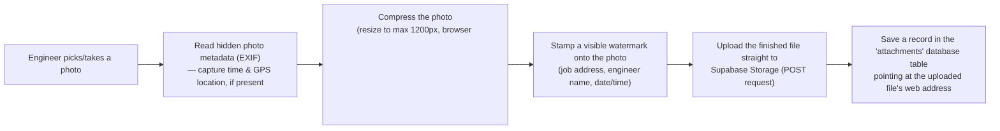

Nothing here uses a dedicated image-processing library — the compression and the watermark are both done "by hand" using the browser's built-in `<canvas>` drawing API, and the metadata reading is done by manually reading the raw bytes of the photo file (there is no EXIF-reading library used).

**Public access:** for photos to display directly in `` tags (in the Office app and Client Portal) without extra authentication steps, the bucket must be marked "public" in Supabase — this is documented as a manual one-time setup step, not something guaranteed by the code.

There is no image CDN, no thumbnail generation service, and no server-side image processing — everything happens once, at upload time, in the browser.

---

## 7. Authentication Architecture

This is one of the more important sections, because the three apps use **two completely different security models.**

```mermaid
flowchart TD
  subgraph Office["index.html / office.html"]
    O1["Enter email + password"] --> O2["Supabase Auth checks credentials"]
    O2 --> O3["Look up matching row in 'users' table<br/>by auth ID (or email as fallback)"]
    O3 --> O4{"role = 'engineer'?"}
    O4 -- yes --> O5["Rejected — told to use the Engineer Portal instead"]
    O4 -- no --> O6["Logged in as Admin / Manager / Finance / Staff"]
  end

  subgraph Eng["engineer.html"]
    E1["Enter email + password"] --> E2["Supabase Auth checks credentials"]
    E2 --> E3["Look up matching row in 'users' table"]
    E3 --> E4{"role = 'engineer' AND active?"}
    E4 -- no --> E5["Rejected"]
    E4 -- yes --> E6["Logged in as Engineer"]
  end

  subgraph Portal["client-portal.html"]
    P1["Open a link like<br/>client-portal.html?id=XXXX&type=landlord"] --> P2["No login screen at all —<br/>the ID in the link is looked up directly"]
    P2 --> P3["If a matching landlord/agency/agent record<br/>exists, the portal is shown"]
  end
```

### 7.1 Office app and Engineer app — real login

Both use **Supabase Auth** (email + password). The process:

1. The app sends the email/password to Supabase Auth, which checks it and returns a session token if correct.
2. Having a valid Supabase login only proves *who you are* — it does not by itself say *what you're allowed to do*. So the app then looks up a matching row for that person in a database table called `users`, which stores their **role** (Admin, Manager, Finance, Staff, or Engineer) and various yes/no permission flags (can edit, can delete, can see prices, can see landlord phone numbers, etc.).
3. The Office app refuses to let anyone with role `engineer` in — they're told to use the separate Engineer Portal instead. The Engineer app does the opposite: it refuses anyone whose role isn't `engineer`, or whose account has been marked inactive.
4. There is a hardcoded "emergency admin" safety net: a small list of protected email addresses that, if their `users` profile is ever missing or downgraded, automatically get their Admin access restored on next login. This exists so the business owner can never accidentally get locked out of their own system.
5. A setting called `pinLock` controls whether login is required at all. **This is an important gap to know about:** if this setting is turned off, the Office app does not just skip showing the login screen — it automatically logs the browser in *as the first user found in the settings*, with no password check whatsoever. Anyone who opens the app with this setting off gets real access under that user's identity. The name "PIN lock" is a leftover from an earlier design; in the current code there is no actual PIN number involved — it is really just a hidden "require login?" on/off switch, and treating it as a security feature would be a mistake.
6. There is also some unused, disconnected code (`_issueOfficeSession`/`_checkOfficeSession`) that looks like it was an earlier attempt at session handling using the browser's local storage. It is never actually called anywhere in the current app — real session handling is done entirely by the Supabase Auth library itself, which keeps its own login token in the browser automatically.

### 7.2 Client Portal — no login at all

The Client Portal has **no authentication system whatsoever.** Access works like a shared, secret link: the URL contains an ID (e.g. `?id=3f9a...&type=landlord`), and the portal simply looks up whichever landlord, agency, or agent has that ID in the database. If a link like this is forwarded, guessed, or leaked, anyone with it can view that client's jobs, invoices, and certificates. The only thing protecting this data is the database-level security rules described in Section 8 (Row Level Security) — there is no password, no email verification, and no expiry on these links in the code reviewed.

### 7.3 Permissions after login

Office-side permissions (who can edit a job, delete a job, see prices, etc.) are stored as plain yes/no columns on that person's row in the `users` table, and are only used to hide/show buttons and menu items in the interface — they are **not double-checked by a server**, because there is no server. A second, separate permission system exists for per-engineer visibility rules (e.g. "this engineer isn't allowed to see the client's phone number"), but this is stored inside the general settings data, not the `users` table — and it is configured in the Office app's Settings screen but **is never actually read or enforced by the Engineer app itself**, meaning this feature currently has no real effect.

---

## 8. Database Architecture

DeepFlow uses a single Postgres database (this is the database technology behind Supabase), with roughly 20 tables, all sitting "flat" — there is no schema separation (like separate schemas per app), and no version-controlled migration history.

### 8.1 The tables

| Table | Holds | Written by | Read by |
|---|---|---|---|
| `users` | Login profile, role, permission flags, GPS position (`last_lat`/`last_lng`/`last_seen`) | Office (admin), Engineer (own GPS) | All apps |
| `jobs` | Every job: address, date, engineer, status, price, etc. | Office, Engineer (status/notes) | All apps |
| `persons` | Landlords / individual clients | Office | All apps |
| `agencies` | Letting/managing agencies | Office | All apps |
| `agents` | Individual agents working for an agency | Office | All apps |
| `invoices` | Invoices, proformas, disposable invoices, and credit notes (all one table, told apart by a status/type field) | Office | Office, Client Portal |
| `certs` | Compliance certificates (Gas, EICR, PAT, etc.) and their expiry dates | Office | All apps |
| `payments` | Payments recorded against invoices | Office | Office |
| `expenses` | Business expenses (fuel, materials, tools, etc.) | Office | Office |
| `overtime` | Engineer overtime/absence entries | Office | Office |
| `job_comments` | Internal comments/notes on a job | Office | Office |
| `activity` | General activity/audit feed shown throughout the app | All apps | Office |
| `attachments` | Metadata for uploaded photos/files (points at Storage) | Engineer | Office, Client Portal |
| `engineer_requests` | Overtime/leave requests from engineers, and also client "please book a job" requests from the portal | Engineer, Client Portal | Office |
| `engineer_alerts` | Office → Engineer broadcast messages (auto-expire after 1 hour) | Office | Engineer |
| `audit_log` | A strict, Admin-only trail of two specific sensitive actions: job deletions and invoice-amount changes | Office | Office |
| `cert_reminder_log` | Prevents sending duplicate certificate-expiry reminders (used only if the optional scheduled reminder feature is set up) | Postgres scheduled function (optional) | — |
| `ratings` | Star ratings for completed jobs | — | Client Portal |
| `app_settings` | **One single row** holding the entire app configuration as one big block of JSON (company details, templates, cert types, and even the list of properties) | Office | All apps |

### 8.2 How records are linked to each other

This is an important structural point: **most relationships between records are matched by comparing name text, not by a proper database link (a "foreign key").** For example, a job "belongs" to a landlord because `job.landlordName` is spelled the same as `person.name` — not because the job stores that person's ID. The same pattern is used to connect jobs to properties, and engineers to their certificates.

This is simple to build but fragile: if a name is typed slightly differently, spelled inconsistently, or a client is renamed, the link between records can silently break. The app does include some duplicate-detection and a "merge two records into one" tool to help reduce this risk, but the underlying design still relies on text matching rather than solid database relationships.

### 8.3 The "properties" table doesn't exist

Worth calling out specifically: **Properties are not stored as a database table at all.** They live as a list inside the single `app_settings` JSON blob described above. This means properties can't be queried efficiently by the database and are always loaded/saved as one big lump together with all other settings.

### 8.4 Security model — Row Level Security (RLS)

Postgres has a built-in feature called **Row Level Security**, which lets the database itself decide who is allowed to read/write which rows, regardless of what the application code does. This is the *real* gatekeeper for this system, because (as explained above) there is no backend server double-checking requests.

The code's own internal documentation is explicit about this: it currently ships with a big warning that most tables use a permissive `allow_all` policy (meaning: no real restriction at the database level) and that properly locking this down is an outstanding task, not something already completed. Some individual "fix" policies have been added over time for specific tables (like restricting who can edit user accounts), but the overall posture, by the developer's own admission, is not production-hardened.

---

## 9. File Relationships

The four files do not `import` or reference each other directly — there is no shared file that all three load. Instead, each file is a fully self-contained copy that happens to talk to the same database. The diagram below shows what actually connects them.

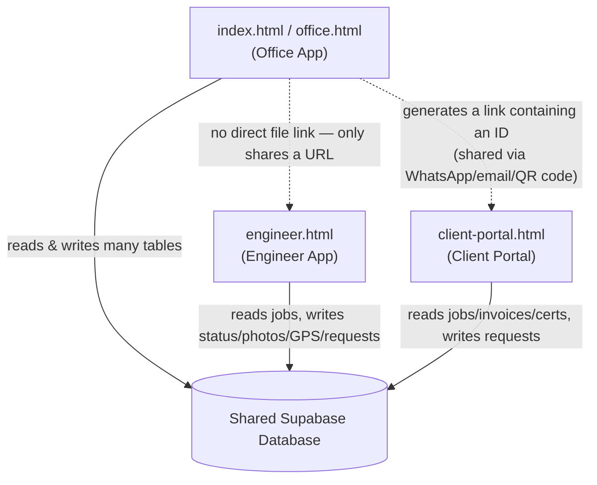

**Duplicated code across files:** each of the three apps contains its own private copy of:
- The Supabase project URL and API key
- The small helper function that sends requests to the database (`fetch` wrapper)
- The mapping table that converts database column names (like `landlordname`) into the JavaScript names the app uses (like `landlordName`)

Because this logic is copy-pasted three times instead of shared, a bug fix or schema change made in one app is **not automatically reflected in the others** — a developer has to remember to update all three files by hand. This is one of the biggest maintenance risks in the current setup (expanded on in Section 15).

---

## 10. Cross-App Communication

As stated above, the three apps never talk to each other directly (no shared API, no messaging between browser tabs). All "communication" happens indirectly, through the shared database — one app writes a row, another app later reads it.

| What needs to travel between apps | How it actually happens |
|---|---|
| Office assigns a job to an engineer | Office writes to `jobs`. Engineer app doesn't get told — it re-checks the `jobs` table every 30 seconds and finds the new job. |
| Engineer uploads a job photo | Engineer app uploads to Storage + writes to `attachments`. Office only sees it next time it opens that job and re-reads `attachments`. |
| Office sends a broadcast alert to engineers | Office writes a row to `engineer_alerts`. Engineer app checks for new alerts every 15 seconds. |
| Engineer requests overtime/leave, or a client requests a new job | Both write to the same `engineer_requests` table. Office sees these on its "Job Requests" screen. |
| Client wants to view their own jobs/invoices | Office generates a special link (containing that client's database ID) and sends it via WhatsApp/email/QR code. The Client Portal reads that ID straight out of the link's web address. |
| Engineer's live location | Engineer app writes its GPS position directly to that engineer's row in the `users` table roughly every time it changes. Office's "Live Maps" screen reads those same columns when displaying the map. |

**A known weak point:** the Engineer app tries to reuse certain settings (like the list of certificate types) by checking the browser's own local storage, hoping the Office app previously saved them there. This only works if both apps are opened in the *same browser on the same device* — which, in real usage (an office computer vs. an engineer's phone), essentially never happens. In practice, this means the Engineer app almost always falls back to its own hardcoded default list instead of picking up the office's custom certificate types.

---

## 11. Realtime Synchronization

Supabase offers a **Realtime** feature: instead of the app repeatedly asking "has anything changed?", the app can open a live WebSocket connection and the database will automatically push a message the instant a row changes.

**In DeepFlow, this is used in exactly one place: the `jobs` table, and only inside the Office app (`index.html`).**

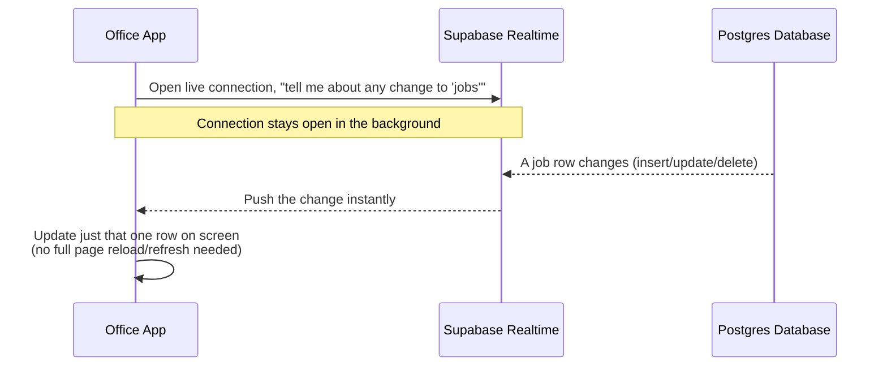

If this live connection drops (e.g. poor internet), the Office app automatically falls back to **polling** — repeatedly asking the database for updates on a timer — and keeps quietly retrying to reconnect the live connection every 10 seconds in the background.

**Everything else in the system uses polling, not true realtime:**
- The Office app checks for new engineer requests/notifications on a repeating timer, not via a live push.
- The Engineer app has no live connection at all — it re-checks its job list every 30 seconds, and checks for broadcast alerts every 15 seconds, plus lets the user manually "pull to refresh."
- The Client Portal has no live updates whatsoever — the page only loads data once, when it's opened. To see new information, the client must reload the page.

**One more safety feature worth mentioning:** if two people are editing the same job at the same time, and the Office app receives a live update for a job the current user already has open, it shows a warning ("this job was updated by someone else") rather than silently overwriting their work.

---

## 12. User Flows

### 12.1 Office staff — running the business day-to-day

1. Log in with email + password.
2. Land on the Dashboard (today's jobs, revenue, alerts at a glance).
3. Create a new job — pick a property/landlord (with auto-suggest and duplicate-phone warnings), pick a trade, pick an engineer, pick a date/time.
4. The job now appears for that engineer (next time their app refreshes).
5. Engineer completes the job (see 12.2) — office is notified live (via Realtime) that the job status changed.
6. The app automatically works out whether a compliance certificate should be created (by matching keywords in the job description) and automatically drafts an invoice.
7. Office reviews/edits the draft invoice, then sends it to the client (via WhatsApp link, email, or generates a downloadable PDF).
8. Office records payment once received, and the invoice is marked Paid.
9. Office can, at any time, check the P&L dashboard, engineer performance reports, the audit log, or the Live Map of where engineers currently are.

### 12.2 Field engineer — doing the job

1. Log in with email + password (stays logged in for 30 days).
2. See today's jobs, sorted by time (or by distance, if GPS is available).
3. Open a job — see the address, access instructions, contact details (subject to what they're allowed to see).
4. Tap "In Progress" when starting.
5. Take before/after photos — the app automatically compresses each photo and stamps it with the job address, their name, and the date/time before uploading it.
6. Add notes (typed or picked from a quick-notes list).
7. Mark the job "Completed" — this is what triggers the automatic certificate/invoice creation described in 12.1.
8. Can also submit an overtime or leave request, which shows up on the office's "Job Requests" screen.
9. Their GPS location is quietly recorded in the background the whole time the app is open, powering the office's Live Map.

### 12.3 Client (landlord / agency / agent) — self-service portal

1. Receives a personal link from the office (via WhatsApp, email, or a QR code).
2. Opens the link — no account or password needed.
3. Sees an overview: compliance status, recent jobs, certificates, invoices, payment details.
4. Can download a certificate or an invoice PDF, or share a certificate link onward.
5. Can raise a new job request through a short form — this gets a reference number and appears immediately in the office's "Job Requests" screen (via the shared `engineer_requests` table).

### 12.4 Office broadcasting to engineers

1. Office clicks the alert/broadcast button, writes a short message, and picks either "all engineers" or one specific engineer.
2. This is saved as a row that expires automatically after one hour.
3. Within 15 seconds, any engineer's app that's open will notice the new alert and show it as a pop-up (with a phone vibration, if supported).

---

## 13. Data Flows

### 13.1 Job → Certificate → Invoice (the core automation of the system)

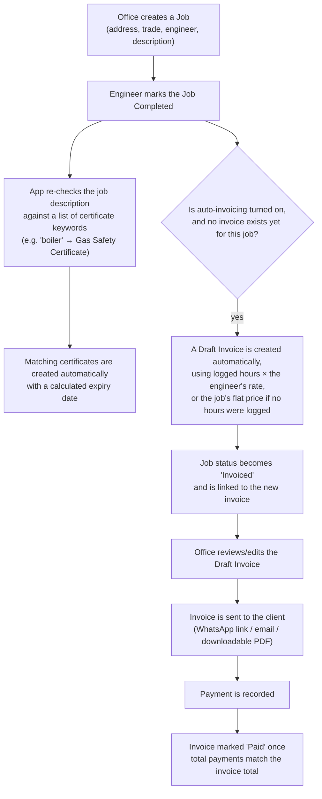

### 13.2 Photo capture → Storage → visible to Office/Client

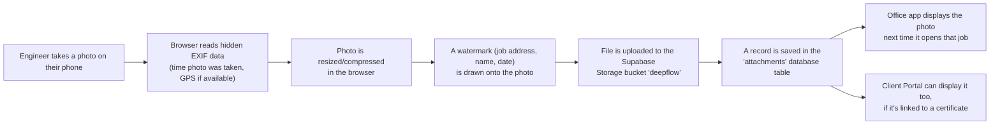

### 13.3 Engineer GPS → Office Live Map

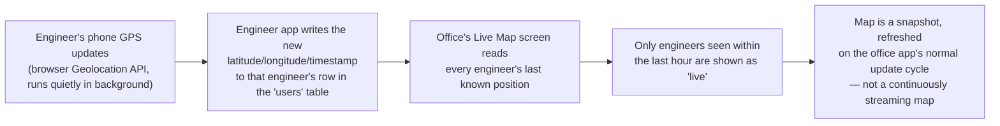

### 13.4 Client request → Office inbox

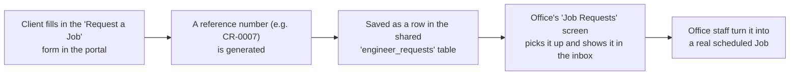

### 13.5 Login → permission flags → what the user can see

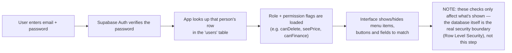

---

## 14. Dependencies — Every External Library Explained

None of these are installed via a package manager (there is no `package.json`). Every one of them is loaded **live, over the internet, from a public CDN**, using a plain `<script>` or `<link>` tag, every time someone opens the app. This means the apps depend on those outside websites being available — if a CDN is down or blocked by a firewall, the affected feature (or the whole app, in the case of the Supabase library) will break.

| Library | Version / Source | Used in | What it actually does | Why it's needed |
|---|---|---|---|---|
| **Supabase JS SDK** (`@supabase/supabase-js`) | v2, from `cdn.jsdelivr.net` | All 3 apps | The official Supabase client library. In this project it is used **only** for logging in/out and (in the Office app) for the live Realtime connection — all normal data reading/writing bypasses this library and uses the browser's own `fetch()` calls directly against the REST API instead. | Needed to talk to Supabase Auth and Realtime; not needed for regular database reads/writes (which are hand-built). |
| **jsPDF** | v2.5.1, from `cdnjs.cloudflare.com` | Office app, Client Portal | Builds PDF files entirely inside the browser — no server involved. | Used to generate downloadable invoices and reports. |
| **jsPDF-AutoTable** | v3.5.31, from `cdnjs.cloudflare.com` | Office app, Client Portal | An add-on for jsPDF that helps lay out tables (rows/columns) inside a PDF. | Used for structured PDF report tables. |
| **Leaflet.js** | v1.9.4, from `unpkg.com` | Engineer app only | An interactive map library (shows a map, markers, zoom/pan). Only loaded when the engineer actually opens the Map screen, not on every page load. | Powers the engineer's in-app map view. |
| **Lucide Icons** | latest, from `unpkg.com` | Client Portal only | A set of clean line-style icons. | The Office and Engineer apps use plain emoji instead, so they don't need this library. |
| **Google Fonts** | via `fonts.googleapis.com` `<link>` tags | All 3 apps (different font choices per app) | Downloads custom web fonts (Office: "Familjen Grotesk" + "JetBrains Mono"; Engineer: "DM Sans" + "JetBrains Mono" + "Orbitron"; Client Portal: "Inter"). | Purely visual — for consistent, modern-looking text instead of default system fonts. |

**Built-in browser features relied on (not external libraries, but still real dependencies on what the browser supports):**

- **Fetch API** — every network request to Supabase.
- **Geolocation API** — engineer live location tracking.
- **Notification API** — browser pop-up notifications for new jobs/alerts.
- **Canvas API** — photo compression, photo watermarking, and the animated background graphics on the login screens.
- **FileReader / DataView / ArrayBuffer** — used to manually read the raw bytes of a photo file to extract EXIF metadata (there is no dedicated EXIF-reading library — this was hand-written).
- **localStorage** — remembering theme choice, saving draft form data, remembering login sessions, and (weakly) trying to share settings between apps on the same device.
- **Clipboard API** and **Web Share API** — "copy link" and "share" buttons throughout the apps.

---

## 15. Architectural Risks & Notes for Future Maintainers

This section exists so a new team doesn't have to rediscover these issues the hard way. None of these are exotic — they are the natural result of a fast-moving, single-developer project that grew organically without a formal architecture review.

1. **Database security is currently permissive.** The project's own internal documentation admits most tables use an "allow everything" security rule rather than proper per-user restrictions. Combined with the fact that the database's public API key is visible in the page source of all three apps, and that the Client Portal has no login at all, this should be treated as the top priority to review before this system is considered production-hardened.

2. **Turning off the `pinLock` setting removes login entirely for the Office app** — it doesn't just skip a screen, it logs the browser in as a real user automatically. This is easy to misunderstand as a harmless convenience toggle.

3. **Core logic is duplicated three times, not shared.** The Supabase connection details, the database field-name mapping, and the basic fetch helper function are copy-pasted independently into all three HTML files. A fix made in one file has to be manually repeated in the others, or they will drift out of sync (there is already evidence of small inconsistencies between the copies — see point 6).

4. **Most data relationships rely on matching text names, not database IDs.** Jobs are linked to landlords, properties, and engineers mostly by comparing spelled-out names rather than solid references. This is fragile — small typos or a client renaming themselves can silently disconnect records — and it also makes some reports (e.g. financial totals grouped "by client") potentially double-count or miss records.

5. **Some settings that look like real database tables are not.** "Properties" and per-engineer visibility permissions are both stored inside one big JSON blob in a single settings row, not as proper searchable tables.

6. **A configured feature that appears to do nothing:** per-engineer visibility permissions (e.g. hiding prices from a specific engineer) can be configured in the Office app's settings, but the Engineer app never actually reads or applies them — so right now, changing this setting has no real effect.

7. **No automated tests, no CI/CD pipeline, no schema version control.** Every deployment is "manually upload the changed HTML file(s)." Every database change is "manually run some SQL in the Supabase dashboard." There is real risk of the live database schema and the code's expectations drifting apart over time, since nothing enforces them staying in sync.

8. **All dependencies are loaded live from third-party CDNs, unpinned to an exact build.** If any of jsdelivr, cdnjs, unpkg, or fonts.googleapis.com is unreachable (network policy, outage, etc.), the relevant part of the app — in the worst case, the Supabase library itself — will fail to load, and the app may not function at all.

9. **Business logic runs entirely in the browser and is not re-checked anywhere else.** Any calculation, validation rule, or workflow (like "only draft an invoice if one doesn't already exist") is trusted JavaScript running on the end user's own device. A sufficiently technical user could call the underlying Supabase API directly and bypass these rules, limited only by whatever Row Level Security is (or isn't) configured on the database.

---

*This document reflects a full manual review of all four files in the repository as of the current codebase state. No code was modified in the process of producing this document.*
