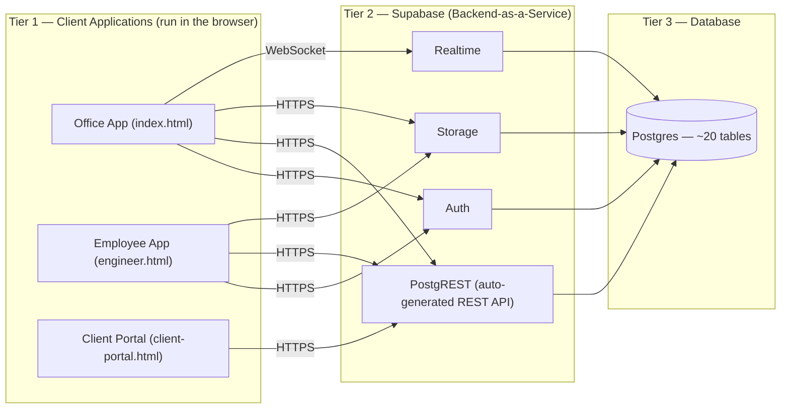
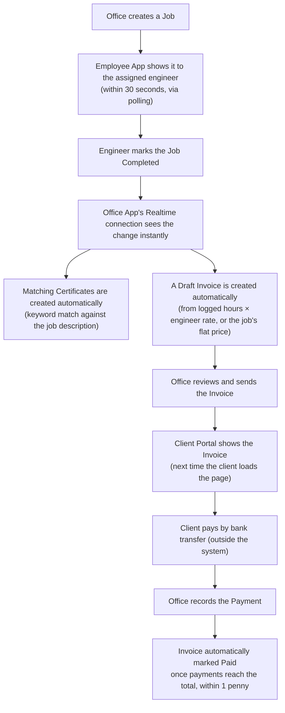

# 01 — System Architecture

This document explains every architectural layer of DeepFlow, end to end. Related documents: [02_Office_App.md](02_Office_App.md)–[04_Client_Portal.md](04_Client_Portal.md) (what each app does), [05_Database.md](05_Database.md) and [06_Supabase.md](06_Supabase.md) (the data layer in full depth), [10_Synchronization.md](10_Synchronization.md) (how data moves between apps).

---

## 1. High-Level Architecture

DeepFlow is a **3-tier system**, but the middle tier is not custom-built — it is entirely Supabase, a third-party Backend-as-a-Service platform. No backend server code was written for this project at all.

**The single most important architectural fact:** the three applications never communicate with each other directly. Every interaction between them happens by one app writing to the shared database and another app either being pushed that change live (Realtime — the `jobs` table only, Office App only) or discovering it the next time it polls or loads a screen. Full detail in [10_Synchronization.md](10_Synchronization.md).

## 2. Low-Level Architecture

Each of the three HTML files is internally structured identically, in four parts, in this order:

1. `<head>` — page metadata, icon data, web font `<link>` tags, and third-party library `<script>` tags loaded from public CDNs.
2. `<style>` — all CSS for the entire application, in one block, using CSS custom properties (variables) for theming (light/dark mode).
3. `<body>` markup — the HTML for every screen and every modal/dialog the app has, all present in the page at once and shown/hidden with CSS classes (there is no client-side router — one URL, many "pages" toggled by JavaScript).
4. `<script>` — all application logic: the Supabase connection setup, a hand-written REST fetch wrapper, every business rule, and every render function.

There is no component framework (no React/Vue/Angular/Svelte). Screens are built by JavaScript functions that generate HTML as text (template literals) and insert it with `element.innerHTML = ...`. State lives in plain JavaScript variables and objects — a global `S` object for settings, `_appUser` for the logged-in identity, and several in-memory arrays acting as data caches.

## 3. Frontend Architecture

Full per-screen breakdown is in [02_Office_App.md](02_Office_App.md)–[04_Client_Portal.md](04_Client_Portal.md) and [14_UI_Documentation.md](14_UI_Documentation.md). The architectural pattern common to all three:

- **No build step.** What you see in the file is exactly what the browser downloads and runs — no transpiling, no bundling, no minification.
- **No shared code module.** Each app has its own independent copy of the Supabase connection logic (URL, key, fetch wrapper, and the camelCase-JavaScript-to-lowercase-database field-name mapping). This is the single biggest source of drift risk in the whole codebase — a fix in one app does not automatically apply to the others. (Confirmed drift already exists: the Employee App queries a different, wrong settings table than the Office App uses — see [18_Known_Issues.md](18_Known_Issues.md).)
- **PDF generation** happens entirely client-side via the jsPDF library (Office App and Client Portal only).
- **Styling** uses hand-written CSS with custom properties for theme switching; no CSS framework is used anywhere.

## 4. Backend Architecture

There is no backend in the traditional sense — no Node.js, Python, PHP, or any other server process written for this project. All reading and writing of data happens via direct calls from the browser to Supabase's auto-generated REST API (PostgREST), which turns every database table into a REST endpoint automatically, with no custom code required.

**Consequence:** essentially all business logic — calculating invoice totals, deciding when a job should auto-invoice, checking permissions — runs as JavaScript in the user's own browser, not on any server. The only real server-side logic in the whole system is a small number of optional Postgres functions (SQL, not JavaScript), documented in full in [06_Supabase.md](06_Supabase.md) and [07_SQL_Migrations.md](07_SQL_Migrations.md) — and, per direct live testing, most of them are not currently installed.

## 5. Database Architecture

Full detail in [05_Database.md](05_Database.md). Summary: a single Postgres database with roughly 20 tables, no confirmed foreign keys for the majority of relationships (most links are by matching text names, e.g. a job's `landlordName` field matching a `persons.name` value, rather than a database reference), one confirmed index, no confirmed triggers, and no views. Application configuration (company details, invoice templates, certificate types, the entire property list) is stored as a single JSON blob in one database row rather than as normal tables.

## 6. Supabase Architecture

Full detail in [06_Supabase.md](06_Supabase.md). One Supabase project serves all three apps, providing: Auth (login for the Office and Employee apps only), the auto-generated REST API (used by all three apps for all data access), Storage (one bucket, `deepflow`, used for engineer-uploaded photos/documents), and Realtime (one live channel, watching only the `jobs` table, used only by the Office App).

## 7. Authentication Architecture

Full detail in [08_Authentication_and_Roles.md](08_Authentication_and_Roles.md). Two different models exist side by side:

- **Office App and Employee App:** real Supabase Auth (email + password), cross-checked against a `users` table row that stores role and permission flags.
- **Client Portal:** no authentication at all — identity is established purely by an ID present in the page's URL.

## 8. Authorization Architecture

Full detail in [08_Authentication_and_Roles.md](08_Authentication_and_Roles.md) and [13_Business_Rules.md](13_Business_Rules.md). Authorization is role-and-flag-based (five roles: Admin, Manager, Finance, Staff, Viewer, plus a separate Engineer case) and is enforced **only** in the browser, to decide what the interface shows — it is not re-checked by the server, beyond whatever Row Level Security is actually configured on the database (tested directly and documented in [15_Security.md](15_Security.md)).

## 9. Storage Architecture

Full detail in [09_Storage.md](09_Storage.md). One bucket, `deepflow`, with files organised as `jobs/<job id>/<timestamp>-<random>.<extension>`. Only the Employee App uploads; the Office App and Client Portal only read and (Office App only) delete.

## 10. Realtime Architecture

Full detail in [10_Synchronization.md](10_Synchronization.md). Exactly one live subscription exists in the entire system: the Office App's channel watching every insert/update/delete on the `jobs` table, opened right after login. No other table and neither of the other two apps use Realtime — everything else relies on polling or a one-time page load.

## 11. Synchronization Architecture

Covered exhaustively in its own document: [10_Synchronization.md](10_Synchronization.md). In summary: there is no direct app-to-app sync; every "sync" is one app writing to Supabase and another app either being pushed the change live (Realtime, `jobs` table, Office App only) or discovering it via polling (Office App fallback: 5 seconds; Employee App: 30 seconds for jobs, 15 seconds for alerts) or a fresh page load (Client Portal, which never re-syncs after its initial load).

## 12. Deployment Architecture

Full detail in [16_Deployment.md](16_Deployment.md). There is no deployment pipeline, no CI/CD, and no build step. "Deploying" this system means uploading the (currently two, previously three — see [00_Project_Overview.md](00_Project_Overview.md)) HTML files to any static file host. Each file is entirely self-sufficient.

## 13. GitHub Architecture

🔴 **Not applicable / not present.** No `.github/` folder, no GitHub Actions workflow files, and no CI/CD configuration of any kind were found anywhere in the repository. If this project is hosted on GitHub at all, it is being used purely as file storage/version history, not as an automation platform. Recommendations for introducing basic CI are in [16_Deployment.md](16_Deployment.md) and [19_Future_Roadmap.md](19_Future_Roadmap.md).

## 14. Data Flow

The canonical example — a job's life from creation to being paid — visualised (full narrative version in [12_Workflows.md](12_Workflows.md)):

## 15. Application Flow

How a user's session actually proceeds, per app:

- **Office App:** open page → see login screen (unless `pinLock` is off — see [08_Authentication_and_Roles.md](08_Authentication_and_Roles.md) for why that matters) → log in → land on Dashboard → navigate via the sidebar between single-page "screens" (no URL changes) → log out returns to the login screen.
- **Employee App:** open page → login screen (or auto-resume a session up to 30 days old) → land on Today's jobs → navigate via the bottom tab bar → background GPS tracking and alert polling run for the whole session → log out clears the session and the last known GPS position.
- **Client Portal:** open a personal link → data loads once → navigate via top tabs → no login, no logout, no session at all — closing the tab is the only "exit."

## 16. User Flow

Full step-by-step user journeys (office staff running a day, an engineer doing a job, a client self-serving) are documented in [12_Workflows.md](12_Workflows.md), Section 12 ("User Flows") — repeated here only as a one-line summary per role:

- **Office staff:** log in → create/manage jobs → review auto-generated certificates/invoices → send invoices → get paid → run reports.
- **Field engineer:** log in → see today's jobs → do the work → update status and log hours → take photos → mark complete.
- **Client:** open link → view compliance/job/invoice status → optionally raise a new request.
