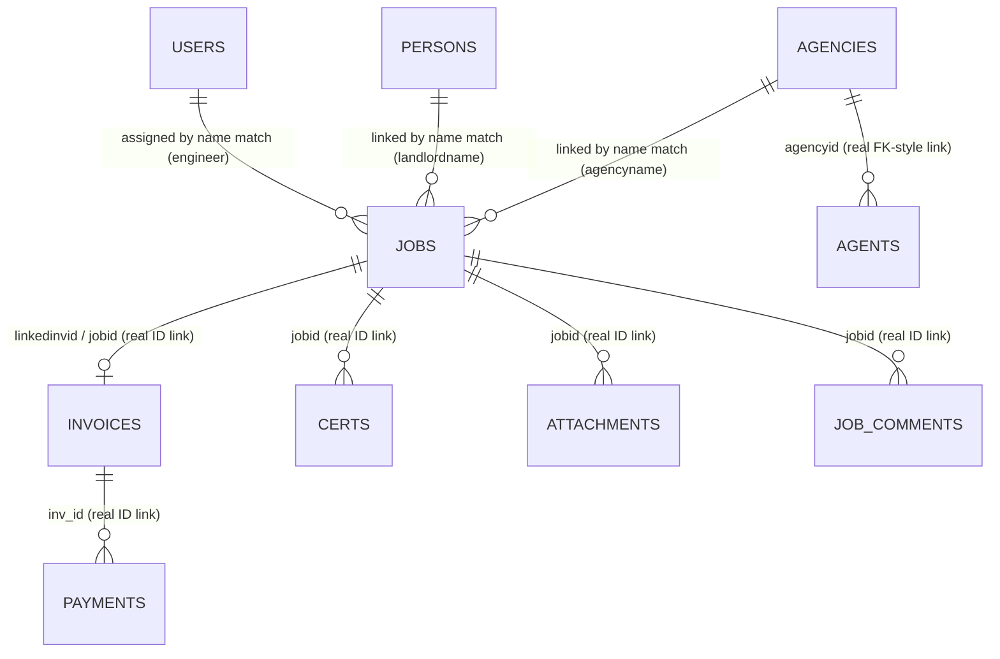

# 05 — Database

The complete table-by-table reference for DeepFlow's Postgres database (Supabase project `dzqyqpuhxdrrpipbehpk`). Every column list below marked 🟢 was read directly from the live database moments before this documentation was written (not guessed from code); tables with 0 live rows are marked 🟡 (column list reconstructed from application code, since an empty table has no sample row to confirm column names against). Full methodology: [../DATABASE_HANDBOOK.md](../DATABASE_HANDBOOK.md), which this document reorganizes and summarizes.

## 1. Notes That Apply to Every Table

To avoid repeating the same disclaimer twenty times: for **every** table below, the following are true unless stated otherwise —

- **Primary Key:** a text `id` column, populated by the application (random UUID from the Office/Employee apps, or an application-generated string), not a database-generated sequence.
- **Foreign Keys:** 🔴 none were found enforced at the database level for the majority of relationships. Most tables link to each other by matching **text values** (e.g. a job's `landlordname` matching a `persons.name`), not by a real reference. The handful of exceptions are called out explicitly per table below. See Section 3 for the full relationship model.
- **Indexes:** 🔴 could not be verified beyond one documented example (Section 8). No index was found confirmed for any of the columns this system actually filters/searches on most.
- **Triggers:** 🔴 none found; very likely none exist — see [07_SQL_Migrations.md](07_SQL_Migrations.md).
- **Views:** 🔴 none found; very likely none exist.
- **Row Level Security Policies:** reads are confirmed open to anyone (no login) on every table tested. Writes vary by table — see [15_Security.md](15_Security.md) Section 3 for exactly which tables were tested and what was found.
- **Nullable fields / default values:** 🔴 not verifiable without direct catalog access; behaviourally, almost every field across every table tolerates being blank, suggesting few or no `NOT NULL` constraints beyond `id`.

## 2. Every Table

### 2.1 `jobs` 🟢 (3 live rows)
**Purpose / why it exists:** one row per piece of work — the central record of the business. **Columns:** `id`, `jobnum`, `address`, `description`, `notes`, `contact`, `access`, `date`, `timeslot`, `engineer` (name, not FK), `trade`, `priority`, `status`, `confirmed`, `price`, `hours`, `referrer`, `landlordname/phone/email/addr/wa/notes`, `agencyname/phone/email/addr/address/notes` (two address columns — a duplication), `agentname/phone/email`, `certtypes`, `invnumber`, `linkedinvid`, `invoice_id` (unused duplicate of `linkedinvid`), `client_person_id`/`client_agency_id` (present, but written by nothing — see Section 3), `checkin_time`/`checkout_time`/`checkin_location`/`client_signature`/`engineer_signature`/`portal_token` (all present, all unused by any application code), `sortorder`, `created`, `modified`. **Applications:** all three (Office writes/edits/deletes; Employee writes status/notes/hours/GPS-adjacent fields and creates new jobs; Client Portal reads only, via name-matching). **Functions using it:** virtually every core workflow — job save, `onJobComplete`, `autoInvoice`, Realtime handler. **Business rules:** [13_Business_Rules.md](13_Business_Rules.md) Section 2–3. **Realtime:** the only table with a live subscription (Office App only). **Performance:** heavily searched by text (address, engineer name) with no confirmed supporting index — see [PERFORMANCE_AUDIT.md](../PERFORMANCE_AUDIT.md). **Example record (synthetic, not real data):** `{id:"a1b2...", jobnum:"JOB-1004", address:"12 Example St", engineer:"J. Smith", status:"Completed", price:150}`.

### 2.2 `users` 🟢 (11 live rows)
**Purpose:** one row per person who can log in (office staff and engineers share this table, split by `role`). **Columns:** `id`, `auth_id` (links to Supabase Auth), `name`, `email`, `phone`, `pin` (present, not used as a real PIN mechanism), `internal_email` (unused), `role`, `active`, `can_edit`/`can_delete`/`can_finance`/`can_invoice`/`see_agent`/`see_contact`/`see_landlord`/`see_landlord_phone`/`see_price` (permission flags), `is_protected` (unused), `last_lat`/`last_lng`/`last_seen`/`last_accuracy` (GPS, written by Employee App only, read by Office App's Live Maps only), `session_token`/`session_expires` (unused — dead-code remnant), `created`. **Business rules:** [08_Authentication_and_Roles.md](08_Authentication_and_Roles.md). **Security note:** confirmed live-readable by anyone with no login — see [15_Security.md](15_Security.md).

### 2.3 `persons` 🟡 (0 live rows)
**Purpose:** landlords/individual clients. **Columns (from code):** `id`, `name`, `phone`, `email`, `address`, `wa`, `notes`, `roles`, `bankName`/`bankAcc`/`bankSort`/`bankRef`, `agencyId`. **Applications:** Office (CRUD), Client Portal (read-only, this table is what a `type=landlord` portal link points at). **Write access:** live-tested — anonymous `INSERT` is **blocked** (Section 3.2 of [15_Security.md](15_Security.md)).

### 2.4 `agencies` 🟢 (1 live row)
**Columns:** `id`, `name`, `address`, `phone`, `email`, `wa`, `website`, `notes`, `bankname`/`bankacc`/`bankref`/`banksort`, `portal_token`/`portal_enabled`/`last_portal_access` (all three unused by any application code). **Real, working relationship:** `agents.agencyid` → `agencies.id` (see Section 3).

### 2.5 `agents` 🟡 (0 live rows)
**Columns (from code):** `id`, `name`, `phone`, `email`, `agencyId`. This is the one place a real, actively-relied-upon ID-based foreign key relationship exists in the whole schema.

### 2.6 `invoices` 🟢 (1 live row)
**Purpose:** every kind of billing document — invoice, proforma, disposable invoice, credit note — in one table, told apart by `status`/`type`/`isCreditNote`. **Columns:** `id`, `number`, `clientid`/`clientname`/`clientemail`/`clientaddr`/`clientwa`, `client_person_id`/`client_agency_id` (unused), `job_id` (unused duplicate of `jobid`), `jobid`, `jobnum`, `jobref`, `linkedjobid`, `jobaddr`/`jobaddress`/`propertyaddress` (three overlapping address fields — inconsistently populated depending which code path created the invoice), `billtoname`/`billtoaddress`, `landlordname`, `agencyname`/`agencyaddress`, `agentname`/`agentemail`/`agentcc`, `invoicetype`, `isagency` (unused), `description`/`desc` (duplicate, only `description` used), `notes`, `terms`, `items` (the real line-item data, a JSON array — this is what totals are actually calculated from), `qty`/`unit`/`subtotal`/`total`/`vat`/`vat_rate`/`vat_amount`/`paid_amount` (an older, flat-column invoice design, superseded by `items` and no longer written to), `pdf_url` (unused — PDFs are generated fresh client-side, never stored), `status`, `date`/`duedate`/`created`/`modified`. **Business rules:** [13_Business_Rules.md](13_Business_Rules.md) Section 5.

### 2.7 `certs` 🟡 (0 live rows)
**Columns (from code):** `id`, `jobid`, `jobnum`, `type`, `address`, `landlord`, `agent`, `certnum`, `issuedate`, `expirydate`, `noexpiry`, `created`. **Important:** the Office App's admin Storage dashboard queries a table called `certificates` (plural-different-spelling) for a count — that table **does not exist**; the real table is `certs`. This is a confirmed bug, not an alternate name — see [18_Known_Issues.md](18_Known_Issues.md).

### 2.8 `payments` 🟡 (0 live rows)
**Columns (from code):** `id`, `inv_id` (maps from JS `invId`), `date`, `amount`, `method`, `ref`, `recorded_by`.

### 2.9 `expenses` 🟡 (0 live rows)
**Columns (from code):** `id`, `date`, `category`, `cost`, `description`, `engineer`, `jobref`, `receipt`.

### 2.10 `overtime` 🟡 (0 live rows)
**Columns (from code):** `id`, `engineer`, `type`, `hours`, `date`, `rate`, `notes`, `created`.

### 2.11 `job_comments` 🟡 (0 live rows)
**Columns (from code):** `id`, `jobid`, author/staff name, `text`, `created`.

### 2.12 `activity` 🟢 (32 live rows)
**Columns:** `id`, `msg`, `type`, `ts`, `created`. **Purpose:** a broad, general "what just happened" feed, written by almost every create/edit/delete action across the Office App, and by the Client Portal on request submission.

### 2.13 `audit_log` 🟢 (2 live rows)
**Columns:** `id`, `type`, `staff_name`, `staff_email`, `staff_role`, `details`, `created_at`. **Purpose:** a strict, Admin-only trail of exactly two event types — job deletion and invoice-amount changes. Not a general log (that's `activity`).

### 2.14 `attachments` 🟡 (0 live rows)
**Columns (from code):** `id`, `jobid`, `name`, `type`, `mime`, `storage_path`, `url`, `uploaded_by_name`, `created`, `photo_slot`, `photo_role`. **Purpose:** the database "index card" for every file in Storage. Full detail: [09_Storage.md](09_Storage.md).

### 2.15 `engineer_requests` 🟡 (0 live rows)
**Columns (from code):** `id`, `engineer_name`, `type` (`overtime`/`leave`/`portal_request`), `date`, `hours`, `rate`, `job`, `leave_type`/`leave_from`/`leave_to`, `notes`, `status`, `office_reply`, `created`. **Write access:** live-tested — anonymous `INSERT` is **blocked** (a likely functional break for the Client Portal's request feature; see [04_Client_Portal.md](04_Client_Portal.md) and [15_Security.md](15_Security.md)).

### 2.16 `engineer_alerts` 🟡 (0 live rows)
**Columns (from code):** `id`, `target`, `type`, `title`, `message`, `sent_by`, `created`, `expires` (created + 1 hour), `status`.

### 2.17 `cert_reminder_log` 🟢 (0 live rows, table confirmed via schema, empty)
**Columns:** `id`, `cert_id`, `sent_at`, `days_before`, `method`. **Purpose:** prevent duplicate scheduled reminders. **Status:** the table exists, but the function that would populate it (`send_cert_reminders()`) is confirmed **not installed** — this table is currently permanently unused. See [07_SQL_Migrations.md](07_SQL_Migrations.md).

### 2.18 `app_settings` 🟢 (1 live row, `key = "__all__"`)
**Columns:** `key`, `value`, `updated`. **Purpose:** the entire application configuration — company details, invoice/WhatsApp templates, certificate types, the whole **properties list**, and per-engineer permission overrides — stored as one JSON blob under one row. Not a normalised settings table.

### 2.19 `settings` 🟢 (0 live rows — a second, separate, near-unused table)
**Purpose:** exists only because of a naming-drift bug — the Employee App queries this table (instead of `app_settings`) for the office's WhatsApp number, always finds nothing, and silently falls back to a hardcoded placeholder. See [03_Employee_App.md](03_Employee_App.md) and [18_Known_Issues.md](18_Known_Issues.md).

### 2.20 Referenced in code but confirmed NOT to exist
`ratings` (Client Portal), `invoice_audit` and `invoice_payments` (Office App's invoice audit-trail feature), `certificates` (Section 2.7), `properties` (Section 2.18), `credit_notes` (never a real separate table — credit notes are rows in `invoices`). Every one of these reads is wrapped in error-swallowing code, so the corresponding feature simply shows nothing, silently, with no visible error.

## 3. Relationships — the Complete Model

**Read this diagram carefully — it mixes two very different kinds of relationship, on purpose, to make the distinction visible:** the Jobs→Invoices, Jobs→Certs, Jobs→Attachments, Jobs→Comments, and Agencies→Agents links are **real, ID-based, and reliable**. The Users→Jobs, Persons→Jobs, and Agencies→Jobs links are **not** — they work by matching text names, which is fast to build but fragile (a typo or a rename silently breaks the link). `jobs.client_person_id` and `jobs.client_agency_id`/`invoices.client_person_id`/`client_agency_id` exist as columns clearly intended to eventually replace the name-matching approach with a real link, but — confirmed by full-text search of the application code — essentially nothing writes to them today; only one narrow fallback read path in the Client Portal uses `client_person_id` at all.

## 4. Data Integrity, Validation, and Business Rules

Every rule governing what gets written to these tables and when is catalogued in full in [13_Business_Rules.md](13_Business_Rules.md) — not repeated here to avoid drift between two copies of the same information. The short version: **all validation is client-side.** Nothing in the database itself was found enforcing business rules beyond the RLS write-permission boundaries documented in [15_Security.md](15_Security.md).

## 5. Security Considerations

Full detail: [15_Security.md](15_Security.md). Summary: every table's data is readable by anyone with no login; write access is inconsistent and only partially tested (some tables confirmed blocked for anonymous writes, others genuinely unverified against real data for safety reasons).

## 6. Potential Improvements

See [19_Future_Roadmap.md](19_Future_Roadmap.md) for the prioritised version. Database-specific highlights: add real foreign keys for the name-matched relationships (finish what `client_person_id`/`client_agency_id` started), remove the confirmed-unused columns cataloged per table above, resolve the duplicate-column pairs (`job_id`/`jobid`, `desc`/`description`, the three job-address fields on `invoices`), add indexes on the columns most heavily text-searched, and either finish or drop the `settings` table and the `ratings`/`invoice_audit`/`invoice_payments`/`certificates` references that point at tables which don't exist.
